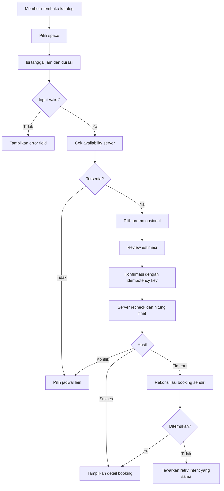
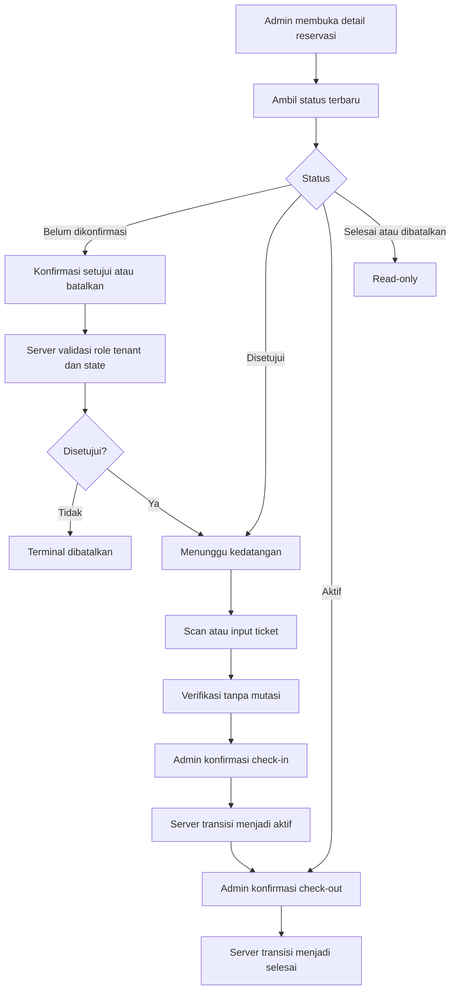
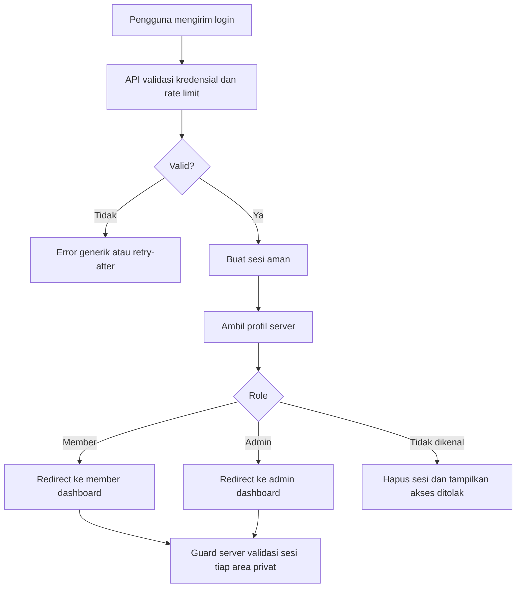
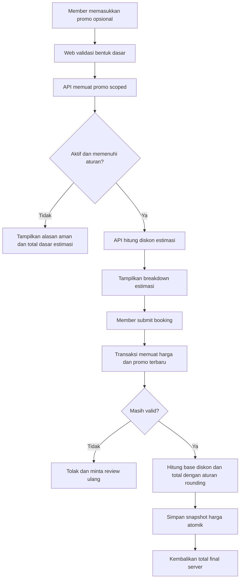
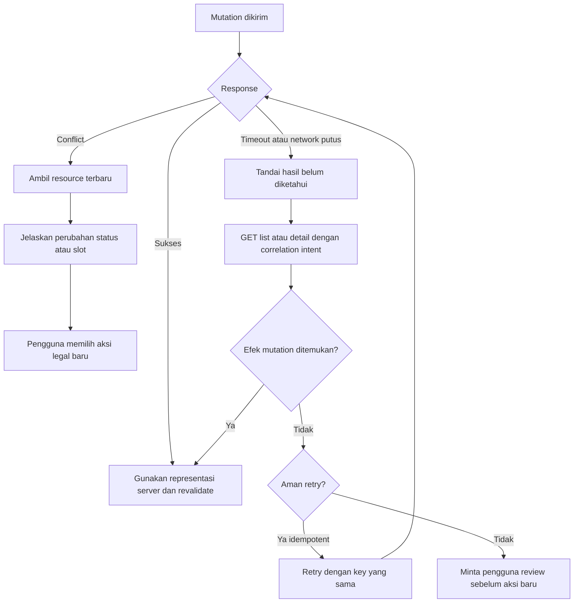

# DESIGN — Smart Space Booking

> **Status: REQUIRED / DESIGN SPECIFICATION ONLY.** Dokumen ini mendefinisikan rancangan implementasi. Dokumen ini tidak menyatakan UI, API, basis data, infrastruktur, pengujian, atau deployment telah diimplementasikan.
>
> **Target teknis:** monorepo dengan `apps/web` (Next.js App Router + TypeScript), `apps/api` (NestJS + Prisma), MySQL pada Amazon RDS, media pada Amazon S3, dan kontrak eksplisit OpenAPI melalui `packages/api-client`.
>
> **Bahasa produk:** Bahasa Indonesia (`id-ID`). **Target aksesibilitas:** WCAG 2.2 AA.

## 1. Status dan Aturan Interpretasi

- **REQUIRED:** wajib untuk memenuhi kebutuhan produk atau kontrak.
- **DESIGN DECISION:** keputusan desain yang mengikat implementasi sampai direvisi secara eksplisit.
- **ASSUMPTION:** default aman dan reversibel yang masih harus divalidasi.
- **OPTIONAL:** peningkatan yang dapat ditunda tanpa mematahkan alur inti.
- **OPEN QUESTION:** keputusan belum final dan tidak boleh disamarkan sebagai perilaku yang sudah tersedia.

Urutan otoritas adalah kebutuhan terbaru pengguna, kontrak OpenAPI yang disepakati, aturan bisnis, keputusan desain ini, lalu asumsi. Bila dokumen dan runtime kelak berbeda, kontrak serta implementasi harus direkonsiliasi; frontend tidak boleh menebak field atau status.

## 2. Product and Technical Context

Smart Space Booking melayani tiga konteks pengalaman:

1. **Publik:** menemukan space dan promosi sebelum autentikasi.
2. **Member:** mencari space, membuat reservasi, memantau booking, dan memakai e-ticket.
3. **Admin:** mengelola profil, member, space, promosi, operasi reservasi, check-in, dan laporan.

**REQUIRED:** otorisasi selalu ditegakkan di API. Penyembunyian tombol atau route guard di web bukan batas keamanan. Harga, diskon, ketersediaan, konflik jadwal, status, dan laporan final bersifat server-authoritative.

**DESIGN DECISION:** frontend tidak mengimpor controller, service, Prisma model, atau kode basis data. Backend tidak bergantung pada komponen Next.js. Prisma model tidak otomatis menjadi response DTO. Setiap aplikasi memiliki validasi environment, build, runtime config, health check, dan deployment workflow sendiri.

## 3. Design Specification

### 3.1 Design Overview

**Visi:** menjadikan pencarian dan reservasi ruang kerja terasa jelas, dapat dipercaya, dan terkendali dari penemuan hingga kunjungan, sekaligus memberi admin alat operasional yang aman tanpa mengorbankan keramahan pengalaman.

**Persepsi yang diinginkan:** Smart Space Booking harus dipersepsikan profesional tetapi tidak kaku, premium tetapi tetap terjangkau, modern tetapi mudah dipahami, dan transparan terhadap harga, jadwal, status, serta konsekuensi tindakan.

**Hubungan marketing dan aplikasi:** website publik membangun minat dan keyakinan melalui narasi, foto, fasilitas, dan promosi; aplikasi member mengubah minat menjadi tugas reservasi yang terukur; aplikasi admin menjaga janji marketing melalui data ruang, ketersediaan, konfirmasi, dan layanan kedatangan yang akurat. Bahasa visual tetap satu keluarga, tetapi kepadatan dan prioritas informasi mengikuti konteks.

| Konteks | Sasaran pengalaman | Perbedaan utama |
|---|---|---|
| Publik | inspirasi, pembuktian kualitas ruang, dan discovery | komposisi editorial lebih lapang; CTA pencarian dominan; tidak memperlakukan availability sebagai jaminan |
| Member | penyelesaian booking dan pemantauan status | jadwal, harga, status, serta next action lebih dominan daripada narasi marketing |
| Admin | keputusan operasional cepat dan aman | kepadatan data lebih tinggi, filter persisten, action matrix berbasis state, dan dekorasi minimum |

**REQUIRED:** desain mendukung alur lengkap Pengunjung → autentikasi → Member → reservasi → e-ticket serta Admin → konfirmasi → check-in → check-out → laporan.

Sembilan prinsip pengalaman berikut wajib dipertahankan secara makna:

1. **Clarity first:** harga, kapasitas, fasilitas, tanggal, waktu, status, dan aksi utama terlihat tanpa hover.
2. **Server authoritative:** UI membedakan estimasi dari hasil final server; server menjadi sumber kebenaran harga, availability, dan status.
3. **Failure-aware:** loading, empty, invalid, forbidden, not found, conflict, offline, timeout, partial data, dan hasil mutasi belum diketahui dirancang sebagai state utama.
4. **Role-safe:** pengalaman publik, member, dan admin berbeda; satu akun menggunakan satu role kontrak dan redirect tidak memberi kewenangan.
5. **Tenant-safe:** request, respons, cache privat, pencarian, dan mutasi selalu terikat tenant dan subject yang sah.
6. **Mobile-first:** alur inti berfungsi mulai viewport kecil; layar admin tetap efisien, terbaca, dan dapat dioperasikan pada desktop.
7. **Progressive disclosure:** detail sekunder dapat dilipat, tetapi harga, status, risiko, dan konsekuensi aksi tidak disembunyikan.
8. **Accessible and inclusive:** penggunaan keyboard, screen reader, zoom, reflow, reduced motion, kontras, dan bahasa yang mudah dipahami adalah kebutuhan inti, bukan tambahan.
9. **Original:** aset, copy, ikon, komposisi, dan token dibuat untuk Smart Space Booking; referensi hanya menjadi inspirasi pola, bukan sumber penyalinan.

| Persona | Tujuan | Risiko pengalaman | Respons desain |
|---|---|---|---|
| Pengunjung | membandingkan space dan promosi | informasi harga/fasilitas tidak jelas | katalog terfilter, detail ringkas, CTA autentikasi kontekstual |
| Member | memperoleh slot dan harga yang benar | availability berubah atau submit ambigu | recheck, idempotensi, ringkasan final server, rekonsiliasi timeout |
| Admin | mengelola inventory dan operasi kunjungan | data padat dan transisi status berisiko | filter URL, aksi berdasarkan state, konfirmasi bernama, audit context |

### 3.2 Brand Direction

Nama merek produk adalah **Smart Space Booking**. Kepribadiannya profesional, tenang, tepercaya, efisien, hangat, dan teliti. Tone komunikasi langsung dan membantu, tidak hiperbolis, tidak menyalahkan pengguna, serta menyebut hasil atau konsekuensi tindakan. Kata kunci visual: **editorial, lapang, arsitektural, teratur, hangat, taktil, modern, dan tepercaya**.

**DESIGN DECISION:** dark teal menyampaikan kestabilan operasional; muted gold memberi aksen premium tanpa menyerupai produk finansial atau status warning. Publik lebih editorial dan berbasis foto; member fokus tugas dengan jadwal/status dominan; admin padat tetapi terstruktur dengan dekorasi minimum.

- **Logo placeholder, bukan desain logo:** sebelum aset logo resmi disetujui, tampilkan wordmark teks “Smart Space Booking” dengan typeface UI; jangan menciptakan simbol, monogram, atau bentuk merek baru. Placeholder tidak boleh diekspor atau disebut logo final.
- **Safe area logo:** minimum setara tinggi huruf kapital `S` di semua sisi; tidak boleh ditembus teks, ikon, border, atau crop.
- **Ukuran minimum:** wordmark layar minimum 144×24 CSS px; pada print minimum lebar 38 mm. Bila ruang lebih kecil, gunakan nama teks utuh yang tetap terbaca, bukan simbol rekaan.
- **Latar terang/gelap:** varian terang memakai dark teal pada surface terang; varian gelap memakai putih pada dark teal. Muted gold hanya aksen dan tidak menggantikan kontras wordmark. Jangan memberi shadow, gradient, outline dekoratif, distorsi, rotasi, atau recolor bebas.
- **Fotografi:** gunakan foto ruang nyata dengan cahaya natural, perspektif manusia, area kerja terlihat, tidak terlalu staged, dan tidak menampilkan individu yang dapat dikenali tanpa izin. Crop menjaga bukti kapasitas/fasilitas; color grading hangat-netral dan konsisten.
- **Ilustrasi:** opsional untuk empty/onboarding, geometris sederhana dengan bidang ruang dan garis arsitektural; bukan karakter kartun, bukan 3D glossy, dan tidak menggantikan foto bukti produk.
- **Arah ikon:** outline Lucide yang sederhana, sudut konsisten, makna literal, tanpa ikon dekoratif berlebihan. Status selalu memiliki label teks.
- Jangan menyalin aset, copy, logo, testimoni, harga, layout identik, atau identitas merek situs referensi. Foto adalah bukti produk; ornamen tidak boleh mengalahkan harga, waktu, kapasitas, atau status.

| Jenis UI writing | Gaya | Contoh |
|---|---|---|
| Label | kata benda/frasa singkat, sentence case, spesifik | “Jam mulai”, “Nomor telepon” |
| Helper | menjelaskan format atau akibat sebelum aksi | “Gunakan format 24 jam.” |
| Error | Bahasa Indonesia aman, menunjukkan koreksi tanpa membocorkan sistem | “Masukkan jam mulai yang valid.” |
| Konfirmasi | menyebut aksi, objek, dan konsekuensi; tombol memakai verba yang sama | “Batalkan booking SSB-1024? Slot akan dilepas.” |
| Success | menyatakan hasil faktual, bukan janji berlebihan | “Booking berhasil dibuat.” |

### 3.3 Color System

Sistem warna memakai dua tingkat: **primitive tokens** menyimpan nilai palet dan tidak dipakai langsung oleh feature; **semantic tokens** memetakan fungsi UI terhadap primitive. Komponen hanya memakai semantic tokens agar perubahan palet tidak mengubah makna domain.

| Primitive token | Nilai | Peran |
|---|---|---|
| `--teal-950` / `900` / `800` / `700` | `#0D292C` / `#123B3F` / `#194B50` / `#246168` | brand gelap, hover, link |
| `--teal-200` / `100` / `50` | `#B9D2D2` / `#DCEAEA` / `#F0F6F5` | border/selected/surface brand |
| `--gold-700` / `500` / `200` / `50` | `#80662E` / `#B89A55` / `#E2D4AE` / `#FAF6EA` | aksen terkontrol |
| `--neutral-0` / `25` / `50` / `200` | `#FFFFFF` / `#FCFCFA` / `#F6F7F5` / `#E2E5E1` | surface dan border |
| `--neutral-500` / `700` / `950` | `#68716D` / `#37423E` / `#101714` | teks |
| `--green-50` / `700` | `#ECF8F1` / `#197044` | success primitive |
| `--amber-50` / `800` | `#FFF7E6` / `#855A12` | warning primitive |
| `--red-50` / `700` | `#FFF0EE` / `#A9342A` | danger primitive |
| `--cyan-50` / `700` | `#EEF6F7` / `#245F69` | info primitive |

| Semantic group | Token dan mapping light-only | Penggunaan |
|---|---|---|
| Background | `--bg-canvas: var(--neutral-25)`; `--bg-surface: var(--neutral-0)`; `--bg-subtle: var(--neutral-50)`; `--bg-brand: var(--teal-900)` | halaman, card, section, header |
| Text | `--text-primary: var(--neutral-950)`; `--text-secondary: var(--neutral-700)`; `--text-muted: var(--neutral-500)`; `--text-on-brand: var(--neutral-0)` | hierarki teks |
| Border | `--border-default: var(--neutral-200)`; `--border-strong: var(--neutral-500)`; `--border-selected: var(--teal-700)` | pemisah dan kontrol |
| Focus | `--focus-ring: #A67C24`; `--focus-offset: var(--neutral-0)` | focus visible 3 px + offset 2 px |
| Interactive | `--action-primary: var(--teal-900)`; `--action-primary-hover: var(--teal-800)`; `--action-primary-active: var(--teal-950)`; `--action-secondary: var(--teal-700)` | default/hover/active; focus memakai token focus |
| Feedback | `--status-success-*`, `--status-warning-*`, `--status-danger-*`, `--status-info-*` memetakan primitive 50 dan 700/800 | alert dan status; selalu dengan ikon+teks |
| Disabled | `--disabled-bg: var(--neutral-50)`; `--disabled-text: var(--neutral-500)`; `--disabled-border: var(--neutral-200)` | state tidak aktif; tidak dipakai untuk menyembunyikan aksi ilegal |
| Overlay | `--overlay-scrim: rgba(16,23,20,.66)` | modal/drawer dengan konten bawah inert |
| Chart | `--chart-1: #246168`; `--chart-2: #80662E`; `--chart-3: #4D7C6B`; `--chart-4: #8A6573`; `--chart-5: #68716D` | seri dibedakan juga dengan label/pola |

Label status reservasi harus tampil persis seperti tabel berikut; nama enum wire tetap mengikuti OpenAPI dan tidak disimpulkan dari label.

| Konsep status | Label UI tepat | Semantic color | Ikon/penjelas |
|---|---|---|---|
| pending confirmation | **Menunggu Konfirmasi** | warning | ikon jam + teks |
| approved | **Disetujui** | info | ikon centang lingkaran + teks |
| active/in use | **Sedang Digunakan** | success | ikon masuk + teks |
| completed | **Selesai** | neutral/success | ikon centang ganda + teks |
| cancelled | **Dibatalkan** | danger/neutral | ikon batal + teks |

**REQUIRED:** mode yang dispesifikasikan hanya **light theme**. Dark mode berada di luar scope dan token dark tidak boleh diimprovisasi. Teks normal minimum 4.5:1; teks besar, border kontrol, dan indikator fokus minimum 3:1. Status dan chart tidak boleh dibedakan hanya dengan warna. Gold bukan primary body text tanpa hasil uji kontras. Forced-colors menggunakan warna sistem dan border nyata.

### 3.4 Typography

Family tokens: `--font-display: "DM Serif Display", Georgia, "Times New Roman", serif`; `--font-ui: Inter, ui-sans-serif, system-ui, -apple-system, "Segoe UI", sans-serif`; `--font-mono: ui-monospace, SFMono-Regular, Consolas, monospace`. Font disarankan self-host untuk privasi, performa, dan kontrol layout shift.

| Token | Mobile size/line-height | Desktop size/line-height | Family/weight | Letter spacing | Penggunaan |
|---|---:|---:|---|---:|---|
| `display` | 40/44 | 64/68 | display/400 | -0.02em | hero publik saja |
| `h1` | 32/38 | 44/52 | display/400 | -0.015em | tepat satu judul halaman |
| `h2` | 26/34 | 34/42 | display/400; UI/700 untuk admin | -0.01em | section |
| `h3` | 22/30 | 28/36 | UI/700 | -0.01em | kelompok utama |
| `h4` | 20/28 | 24/32 | UI/700 | 0 | subsection/card besar |
| `h5` | 18/26 | 20/28 | UI/600 | 0 | judul card/dialog |
| `h6` | 16/24 | 18/26 | UI/600 | 0 | judul kelompok kecil |
| `body-lg` | 18/28 | 18/28 | UI/400 | 0 | lead ringkas |
| `body` | 16/24 | 16/24 | UI/400 | 0 | default |
| `body-sm` | 14/20 | 14/20 | UI/400 | 0 | metadata |
| `label` | 14/20 | 14/20 | UI/600 | 0.005em | label kontrol |
| `caption` | 12/18 | 12/18 | UI/400 | 0.01em | caption nonkritis |
| `price` | 20/28 | 24/32 | UI/700 | -0.01em | nilai IDR |
| `overline` | 12/16 | 12/16 | UI/700 | 0.08em | kategori; uppercase terbatas |

Ukuran responsif `display`, `h1`, dan `h2` menggunakan `clamp()` antara nilai mobile dan desktop agar tidak melonjak pada breakpoint; token lain tetap. Input mobile minimum 16 px. Body dibatasi `max-inline-size: 65ch` (rentang terbaca 60–75 karakter); teks form dapat lebih sempit. Harga, KPI, waktu, kode booking, dan kolom angka tabel memakai `font-variant-numeric: tabular-nums`. Heading dipilih berdasarkan hierarki semantik, bukan ukuran visual. Bold dibatasi 600/700; body panjang tidak memakai 700.

### 3.5 Spacing Grid Layout

Token spacing 8pt dengan intermediate 4pt wajib tepat: **`4, 8, 12, 16, 24, 32, 40, 48, 64, 80, 96, 120` px**. Tidak ada token 2 atau 20 px; nilai khusus hanya boleh untuk border/optical alignment dan harus didokumentasikan.

Breakpoints konfigurasi wajib tepat: **`sm: 640px`, `md: 768px`, `lg: 1024px`, `xl: 1280px`, `2xl: 1536px`**. Styles mobile berlaku di bawah `sm`.

| Area | Lebar/gutter/grid |
|---|---|
| Public marketing | max 1280 px; gutter 16 px mobile, 24 px `sm`, 32 px `md`, 40 px `lg`, 48 px `xl`; 4→8→12 kolom |
| Member app | max 1200 px; gutter 16→32 px; 4→8→12 kolom |
| Admin | fluid dengan max 1440 px untuk content utama; sidebar 264/80 px; data table boleh memakai lebar tersedia |
| Auth/form | auth card max 480 px; form utama max 720 px; form kompleks max 840 px bila field berpasangan |
| Detail space | desktop media 7 kolom dan reservation panel 5 kolom; mobile linear |

- Section publik: 64 px mobile, 96 px desktop; hero boleh 120 px pada desktop.
- Card: padding 16 px compact, 24 px default, 32 px featured; gap internal 8/12/16/24 sesuai hierarki.
- Form: 24 px antarkelompok, 16 px antarfield, 8 px label-ke-kontrol/helper, 32 px sebelum action group.
- Public header 64 px mobile/72 px desktop; admin topbar 64 px.
- Panel reservation sticky desktop memakai `top: 96px`, berhenti pada batas parent, dan kembali statis saat tinggi panel mendekati viewport.
- Bottom action mobile menghormati `env(safe-area-inset-bottom)`, keyboard virtual, serta tidak menutup error atau target fokus.
- Z-index tokens: `base: 0`, `sticky: 20`, `dropdown/popover: 40`, `drawer/modal backdrop: 60`, `drawer/modal: 70`, `toast: 80`, `tooltip: 90`. Komponen tidak membuat nilai ad hoc atau stacking context tanpa kebutuhan.

### 3.6 Shape Border Shadow Motion

| Properti | Spesifikasi |
|---|---|
| Radius input/button | **12 px** |
| Radius card | **16 px** |
| Radius modal/drawer | **20 px**; drawer sisi boleh 20 px pada sisi dalam saja |
| Radius badge | **pill / 9999 px** |
| Border | 1 px solid semantic border; 2 px untuk selected/high contrast bila dibutuhkan |
| Focus ring | 3 px `--focus-ring` dengan offset 2 px; tidak dianimasikan |
| Shadow card | `0 8px 24px rgba(18,59,63,.10)` dengan border tetap |
| Shadow raised | `0 12px 32px rgba(16,23,20,.16)` untuk menu/popover |
| Shadow modal | `0 24px 56px rgba(16,23,20,.24)` |
| Overlay | `--overlay-scrim`; klik backdrop tidak menutup alert destruktif saat pending |
| Control | medium minimum 44 px; large 52 px; touch target minimum 44×44 CSS px |

Motion: `fast 120ms ease-out`, `normal 180ms cubic-bezier(.2,.8,.2,1)`, `slow 240ms` hanya untuk modal/drawer. Transisi hanya opacity, transform, dan warna yang membantu kontinuitas; tidak menganimasikan layout besar. Hover card bergeser maksimal 4 px. Carousel tidak berjalan otomatis. `prefers-reduced-motion` menghapus transform, smooth scroll, autoplay, dan shimmer non-esensial serta mengganti dengan perubahan instan. Elevation tidak menjadi satu-satunya pemisah.

### 3.7 Iconography Images

- Library ikon wajib **Lucide React**; import per ikon agar tree-shakeable. Ikon custom hanya bila konsep tidak tersedia dan wajib mengikuti viewBox/stroke Lucide.
- Ukuran: 16 px untuk metadata, 20 px untuk control/nav default, 24 px untuk status/fitur, 32 px maksimum untuk empty state; stroke konsisten 1.75–2 px.
- Icon button minimum 44×44 dan memiliki accessible name. Ikon status selalu disertai teks; jangan memakai emoji sebagai ikon produk.
- Status: `Clock3` untuk Menunggu Konfirmasi, `CircleCheck` untuk Disetujui, `LogIn` untuk Sedang Digunakan, `CheckCheck` untuk Selesai, `CircleX` untuk Dibatalkan.
- Fasilitas: gunakan ikon literal seperti `Wifi`, `Monitor`, `Projector`, `Snowflake`, `Coffee`, `Users`, dengan label teks dan fallback “Fasilitas lain”.
- Navigasi: satu ikon per item pada admin; active state memakai background, teks, dan `aria-current`, bukan pergantian ikon semata.

| Konteks | Rasio/ukuran | Perilaku |
|---|---|---|
| Hero editorial | **16:9 desktop, 4:3 mobile** | `cover`, focal point terkontrol, prioritas hanya bila LCP |
| Space card | **4:3**, sumber target 800×600 | responsive sizes, lazy kecuali above the fold |
| Detail/gallery | **16:10**, sumber target 1280×800 | gambar utama konsisten; thumbnail 4:3 |
| Avatar | **1:1**, target 256×256 | circular crop, fallback inisial |
| Promotion card | **16:9** | pola/foto yang disetujui, tidak mengarang klaim |
| Promo banner | **16:6** | crop focal-aware; copy tidak dibakar ke gambar |
| QR ticket | minimum 132 CSS px; 30–35 mm print | hitam-putih, quiet zone utuh, tidak di-crop |

**REQUIRED:** media S3 hanya memakai `https:` dan host allowlist. Object key dibuat server, bukan nama file pengguna. Validasi server mencakup autentikasi, tenant, otorisasi, ukuran maksimum 5 MiB, ekstensi, MIME, magic bytes, decode gambar, dan path aman. Alt foto space: `Foto {nama space}` atau deskripsi sudut yang membedakan galeri; dekorasi memakai alt kosong.

### 3.8 Application Information Architecture

Sitemap konseptual mengikuti seluruh route pada matriks Bagian 4: publik (`/`, `/spaces`, detail space, `/promotions`), autentikasi (`/login`, dua registrasi), member (`/member`, katalog/detail, booking baru/list/detail/ticket, riwayat, profil), dan admin (`/admin`, profil, CRUD member/space/promosi, operasi reservasi, check-in, laporan). Matriks Bagian 4 adalah daftar route kanonik lengkap.

| Area/role | Navigasi utama | Visibilitas |
|---|---|---|
| Publik | Beranda, Space, Promosi, Masuk, Daftar Member, Daftar Admin | semua pengunjung; akun aktif diarahkan kontekstual ke area perannya |
| Member | Ringkasan, Cari Space, Booking Saya, Riwayat, Profil | member terautentikasi saja |
| Admin | Dashboard, Profil, Member, Space, Promosi, Reservasi, Check-in, Laporan | admin terautentikasi dalam tenant saja |

Desktop publik/member memakai header horizontal; mobile memakai tombol menu dan drawer dengan urutan yang sama. Desktop admin memakai sidebar 264 px yang dapat menjadi 80 px, sedangkan di bawah `lg` berubah menjadi drawer; topbar memuat judul konteks dan menu akun. Tidak ada role switch.

- Breadcrumb digunakan pada detail/create/edit bila parent berguna, tidak pada landing/dashboard. Item terakhir adalah teks dengan `aria-current="page"`; middle item boleh dipendekkan tanpa menghilangkan nama aksesibel.
- Active navigation ditandai background, teks, dan `aria-current`, bukan warna saja. Page title memiliki tepat satu `h1`, konsisten dengan document title.
- Tombol kembali menggunakan parent route yang deterministik; history back hanya boleh menjadi enhancement dan tidak boleh mengirim pengguna ke luar area sah.
- Filter koleksi disimpan di URL agar bookmark, refresh, dan back/forward konsisten; semua daftar memakai pagination bounded, sort deterministik, default 20, maksimum 100.
- Unauthorized dibedakan: sesi tidak ada/kedaluwarsa menampilkan “Sesi Anda telah berakhir. Silakan masuk kembali.” lalu login dengan `returnTo` internal; role/tenant tidak sah menampilkan halaman akses ditolak tanpa detail resource dan tautan kembali ke area sah.
- Route privat tidak merender data privat sebelum sesi, tenant, dan role tervalidasi. Redirect adalah navigasi, bukan mekanisme otorisasi.

### 3.9 Public Website Specification

Beranda publik terdiri dari tepat 12 section berikut. Hero memakai komposisi editorial asimetris: copy dan search mandiri di satu sisi, media di sisi lain dengan overlap terkontrol; urutan DOM tetap copy→search→media. Carousel space/promosi bersifat controlled, tidak autoplay, memiliki tombol sebelumnya/berikutnya, posisi, swipe opsional, dan alternatif grid; **search tidak berada di dalam carousel dan tetap dapat dipakai secara independen**.

| Section | Purpose | Content | Layout | Components | Mobile | Loading | Empty | Interaction | Accessibility |
|---|---|---|---|---|---|---|---|---|---|
| 1. Header | orientasi dan akses cepat | wordmark placeholder, nav, auth CTA | full-width, content container | PublicHeader, Text link, Button | menu drawer | shell stabil | tidak berlaku | buka/tutup menu | named nav, skip link, current page |
| 2. Hero | menjelaskan nilai utama | headline, supporting copy, CTA, foto ruang | split asimetris editorial 5/7 dengan ruang negatif | Button, Image, overline | copy→CTA→image; crop 4:3 | reservasi dimensi media | image fallback | CTA ke katalog | satu h1, alt kontekstual, tanpa text-in-image |
| 3. Search cepat | memulai discovery mandiri | search, tipe, tanggal opsional bila kontrak mendukung | panel overlap visual hero tetapi sibling DOM | Search input, Select, Date picker, Button | stack full-width | tombol pending | hint pencarian | submit eksplisit; URL state | label nyata, error terasosiasi |
| 4. Trust strip | memberi bukti ringkas | kapasitas layanan/fasilitas faktual yang bersumber data | bar 3 kolom | Icon, text | stack/grid 2 | skeleton pendek | section dihilangkan tanpa gap | noninteraktif | angka memiliki konteks; bukan klaim rekaan |
| 5. Kategori space | mempercepat browse | tipe space dan deskripsi singkat | grid kartu | Card, facility icon | horizontal controlled scroll atau 1 kolom | card skeleton | CTA semua space | pilih tipe mengisi URL filter | heading/link bernama |
| 6. Space pilihan | menampilkan inventory unggulan | foto, tipe, kapasitas, fasilitas, harga | controlled carousel, 3 kartu desktop | Workspace card, carousel controls | 1 kartu per view; grid fallback | card skeleton | CTA katalog | next/previous manual; buka detail | controls berlabel, posisi diumumkan tanpa spam |
| 7. Cara booking | mengurangi ketidakpastian | Cari space, pilih jadwal, konfirmasi, gunakan ticket | empat langkah horizontal | Stepper informatif, Icon | vertical ordered list | static | tidak berlaku | link bantuan opsional | ordered list, ikon dekoratif |
| 8. Fasilitas | menunjukkan amenitas umum | Wi-Fi, monitor, proyektor, AC, kopi, kapasitas | icon grid | Card, facility icons | 2 kolom | static | section dihilangkan bila tanpa data | noninteraktif | ikon selalu dengan teks |
| 9. Promo aktif | mendorong pertimbangan tanpa janji total | kode/nama, persentase, periode, syarat ringkas | promo banner 16:6 + controlled cards | Promotion card, Badge | stack; banner crop aman | skeleton | “Belum ada promosi aktif” + katalog | salin kode dengan konfirmasi; browse | periode tekstual, kontrol carousel bernama |
| 10. Nilai layanan | menjelaskan diferensiasi | transparansi harga, availability, ticket, dukungan | 3-column editorial blocks | Card, Icon | stack | static | tidak berlaku | noninteraktif | heading terstruktur, bukan klaim absolut |
| 11. CTA penutup | mengubah intent menjadi aksi | headline ringkas dan Cari space | centered band tanpa carousel | Button, Text link | stack, full-width button | static | tidak berlaku | ke katalog/register member | CTA unik dan deskriptif |
| 12. Footer | utilitas dan legal | nav, kontak yang disetujui, kebijakan, copyright | multi-column | Footer nav, Text links | accordion hanya jika tetap keyboard-safe | static | item tanpa data tidak ditampilkan | link biasa | landmarks, fokus terlihat, label grup |

Katalog, detail, dan promosi publik mengikuti spesifikasi 3.11–3.12. Promosi publik hanya memuat promo aktif, persentase dan periode dalam teks, state tidak ada promosi, serta CTA menuju katalog; nilai penghematan final tidak diklaim tanpa konteks booking.

### 3.10 Authentication Screens

Desktop memakai split-screen: panel brand/foto yang tidak memuat informasi wajib dan panel form max 480 px; pada mobile menjadi satu kolom dan panel dekoratif disembunyikan agar form muncul pertama. Form tetap lengkap tanpa media.

| Screen | Exact fields | Distinction | Success redirect | Required states |
|---|---|---|---|---|
| Login | `username`, `password` | satu form untuk member/admin; role tidak dipilih pengguna | profile server menentukan `/member` atau `/admin`; `returnTo` hanya internal dan hanya bila sesuai role | idle, validation, submitting, generic invalid credentials, 429 + retry, session conflict, timeout/unknown, server error |
| Registrasi member | `username`, `password`, `nama`, `instansi`, `alamat`, `telepon`, `foto` opsional | copy “Daftar sebagai member”; tidak meminta data coworking | login atau `/member` hanya sesuai kontrak sesi | validation, duplicate username, upload validating/progress/orphan, submitting, timeout unknown, success |
| Registrasi admin | `username`, `password`, `nama coworking`, `nama pemilik`, `telepon`, `alamat` opsional, `deskripsi fasilitas` opsional | copy menjelaskan akun pengelola; bukan registrasi member dengan toggle role | login atau `/admin` hanya sesuai kontrak sesi | validation, duplicate username, submitting, timeout unknown, success |

Username memakai `autocomplete="username"`; login password `current-password`; registrasi `new-password`; nama/telepon/alamat memakai token autocomplete yang cocok. Tombol show/hide berlabel dan mempertahankan posisi kursor. Error kredensial generik tidak mengungkap apakah username ada. Pengguna yang sudah login dan membuka auth route dialihkan oleh profile server ke area sah; role tidak dikenal menghapus sesi dan menunjukkan akses ditolak.

**REQUIRED:** password tidak dicatat, tidak diisi ulang setelah server error, paste/password manager diizinkan, submit ganda dicegah, dan timeout registrasi ditampilkan sebagai hasil belum diketahui sebelum pengguna mencoba ulang.

### 3.11 Workspace Catalog

- Filter eksplisit: pencarian nama/fasilitas sesuai kontrak, tipe, dan kapasitas minimum bila didukung API. Mobile memakai drawer; desktop memakai bar inline; chip merangkum filter aktif.
- Sort control menawarkan opsi kontrak saja, minimal “Rekomendasi” bila server mendukung, “Nama A–Z”, “Harga terendah”, dan “Kapasitas terbesar”; fallback default wajib stabil, misalnya `nama_space ASC, id ASC`.
- Result count selalu terlihat dan berasal dari metadata server, misalnya “24 space ditemukan”; pagination tidak melakukan client slicing atas total palsu.
- `Workspace card` memuat foto, tipe, nama, kapasitas, fasilitas ringkas, harga per jam, status arsip hanya di admin, dan CTA “Lihat {nama space}”.
- Availability **tidak boleh disimpulkan dari kartu katalog**. Bila katalog menampilkan indikator berdasarkan tanggal/jam filter, label wajib “Ketersediaan indikatif” dengan checked-at; slot tetap diperiksa lagi di detail dan saat submit.
- Query hanya dikirim setelah input valid; pencarian didebounce 300–500 ms atau tombol Terapkan. Request lama dibatalkan/diabaikan agar response terlambat tidak menimpa query terbaru.
- Empty tanpa filter menjelaskan belum ada space. No-result menampilkan filter aktif dan “Reset filter”. URL menyimpan filter/sort/page; perubahan filter mereset page ke 1.

### 3.12 Workspace Detail

Halaman memprioritaskan bukti ruang dan keputusan booking: breadcrumb, image gallery, nama, tipe, kapasitas, deskripsi, fasilitas, harga per jam, **jam operasional**, aturan penggunaan yang disetujui, serta form tanggal/jam mulai/durasi. Jam operasional ditampilkan per hari atau ringkasan yang akurat dalam business timezone; hari tutup berlabel “Tutup”. Jika kebijakan jam belum tersedia dari kontrak, tampilkan “Jam operasional belum tersedia”, bukan asumsi.

Desktop memakai media 7 kolom dan panel reservasi 5 kolom yang sticky aman; mobile memakai urutan nama→media→fakta→fasilitas→jam operasional→form dengan bottom action yang tidak menutup field. Gallery mendukung thumbnail keyboard, posisi gambar, alt berbeda bila sudut bermakna, dan fallback.

Form mengumumkan waktu akhir terhitung, batas operasional, dan checked-at. State wajib: loading stabil, 404 scoped, media gagal, partial media, contract error, availability checking, tersedia, tidak tersedia, stale, rate limited, dan network error. Availability menjadi **stale** segera saat tanggal, jam, durasi, space, atau promo terkait berubah; hasil advisory tidak mengunci slot. Reservasi mengulang pemeriksaan atomik.

### 3.13 Reservation Flow

Flow member wajib tepat empat langkah:

1. **Pilih Jadwal**
2. **Pilih Promo**
3. **Tinjau Booking**
4. **Konfirmasi**

| Langkah | Input/konten | Validasi dan server work | Primary action | Loading/error/stale | Mobile dan aksesibilitas |
|---|---|---|---|---|---|
| 1. Pilih Jadwal | space terkunci dari konteks, `tanggal`, `jam mulai`, `durasi`, waktu akhir, jam operasional | bentuk lokal lalu availability API; interval `[start,end)`; dilarang lanjut bila unavailable | “Cek ketersediaan” lalu “Lanjut pilih promo” | checking, unavailable, 429, network; perubahan input membuat hasil stale | field vertikal; stepper mengumumkan langkah 1 dari 4; fokus ke hasil/error |
| 2. Pilih Promo | opsi “Tanpa promo” atau satu `kode promo`; ringkasan jadwal | API memvalidasi scope, periode, aturan, lalu menghitung estimasi | “Terapkan promo”/“Lanjut tinjau” | invalid/expired/not-applicable tanpa membocorkan rule sensitif; perubahan jadwal membatalkan estimasi | radio/combobox sesuai volume; alasan aman ditautkan ke field |
| 3. Tinjau Booking | space, tanggal, `09.00–12.00 WIB`, `3 jam`, base price, diskon, estimasi total, disclaimer | recheck ringan bila estimasi kedaluwarsa; belum membuat booking | “Lanjut konfirmasi” | loading summary, stale availability/promo, contract error | definition list/price table; link “Ubah” mengembalikan ke step terkait |
| 4. Konfirmasi | konsekuensi, identitas booking intent, checkbox hanya jika persetujuan legal memang diperlukan | submit dengan `Idempotency-Key` stabil; API lock/check overlap, hitung ulang, simpan atomik | “Konfirmasi booking” | pending terkunci, success, 409 conflict, validation, timeout hasil belum diketahui; reconcile sebelum retry key sama | action tetap terlihat tetapi tidak menutup konten; status diumumkan sekali |

Response sukses server menjadi satu-satunya sumber kode booking, total final, promo snapshot, dan status. Dua request konkuren untuk slot sama harus menghasilkan satu sukses dan satu conflict. UI tidak memakai optimistic success. Back antarstep mempertahankan input nonsensitif; mengubah jadwal menginvalidasi langkah promo/review. Refresh hanya memulihkan draft bila kebijakan privasi dan expiry eksplisit.

### 3.14 Member Dashboard

Dashboard menampilkan sapaan, KPI booking mendatang dan aktif, **booking terdekat yang actionable**, riwayat terbaru, serta shortcut “Cari space”. Kartu booking terdekat memuat kode, space, jadwal, status, countdown tekstual nonkritis, dan tepat satu next action legal: “Lihat detail”, “Lihat e-ticket” bila tersedia, atau “Batalkan booking” hanya jika server mengizinkan. Tidak ada check-in mandiri kecuali kontrak kelak menyediakannya.

Data kosong bukan error dan menampilkan onboarding ke katalog. Partial failure mempertahankan panel sukses. Booking list memakai filter status bila didukung API, result count, pagination, dan kartu responsif. Detail booking menunjukkan kode, space, jadwal, harga final, promo, status, timeline konseptual, e-ticket bila legal, serta action matrix dari server/state contract. Pembatalan memakai alert dialog yang menyebut kode dan dampak; conflict memicu refetch.

Profil member read-only sampai kontrak menyediakan update diri. Jangan menampilkan tombol edit palsu. Logout membatalkan request, membersihkan cache privat, dan menghapus state sensitif.

### 3.15 E-Ticket and QR Code

E-ticket memuat nama produk, nomor e-ticket, kode booking, identitas member minimum, coworking/space, jadwal, durasi, rincian harga final, status, QR, instruksi kedatangan, dan penjelasan aksesibel: “Kode QR ini digunakan admin untuk memverifikasi booking; gunakan nomor e-ticket atau kode booking bila QR tidak dapat dipindai.” Ticket bukan bukti pembayaran kecuali domain pembayaran tersedia.

- Ticket valid menampilkan status dan instruksi; **invalid** menampilkan “E-ticket tidak valid” tanpa QR aktif dan tautan ke detail; **cancelled** menampilkan watermark/label “Dibatalkan”, QR tidak dapat digunakan, alasan aman bila kontrak mengizinkan; expired/completed bersifat read-only.
- Privasi: tampilkan hanya nama minimum yang diperlukan; sembunyikan alamat, telepon, username, tenant key, dan metadata internal. Jangan memuat data pihak lain di HTML/print.
- QR memakai payload opaque/signed tanpa JWT, secret, tenant key, atau PII. UI tidak membuka payload sebagai URL. Fallback tekstual menampilkan nomor e-ticket dan kode booking, bukan payload mentah.
- Print: A4 portrait, margin 12–16 mm, QR 30–35 mm, grayscale terbaca, navigasi/tombol/toast disembunyikan, dan page break tidak memotong QR atau identitas penting. Print stylesheet menampilkan URL produk hanya bila aman dan tidak mencetak token/query privat.

### 3.16 Admin Dashboard

Dashboard memuat KPI periode yang jelas (jumlah reservasi, reservasi selesai, utilisasi bila definisinya tersedia, dan realisasi pendapatan layanan selesai), antrean perlu konfirmasi, reservasi hari ini, space aktif, serta shortcut operasi. Setiap KPI menyebut unit, periode, definisi, dan perbandingan hanya bila data pembanding tersedia.

Chart digunakan terbatas: maksimum dua visual ringkas di dashboard, tidak memakai 3D, dual axis, pie dengan banyak kategori, animasi dekoratif, atau warna status sebagai satu-satunya pembeda. Semua chart memiliki judul, periode, unit, tooltip keyboard, dan tabel/link data ekuivalen. Antrean lebih penting daripada chart dan tampil lebih dahulu.

Partial failure mempertahankan panel yang berhasil dan menandai panel gagal secara lokal; zero berbeda dari missing. Dashboard tidak melakukan query tak terbatas: preview antrean/hari ini dibatasi, menyatakan jumlah total, dan mengarah ke daftar terfilter lengkap.

### 3.17 Admin Member Management

| Surface | Data/controls | Actions | States dan safeguards |
|---|---|---|---|
| List | search nama/username/instansi sesuai kontrak, status arsip bila ada, result count, sort deterministik, pagination | Tambah member, buka detail, reset filter | loading, empty, no-result, partial image, error; table→labelled cards |
| Create | `username`, `password`, `nama`, `instansi`, `alamat`, `telepon`, `foto` opsional | Simpan, Batal | field validation, duplicate, upload progress/orphan, timeout unknown; password tidak dipertahankan |
| Detail | avatar, nama, username, instansi, alamat/telepon sesuai kebutuhan operasional, status, ringkasan booking bounded | Arsipkan bila legal, kembali | 404 scoped, forbidden, relation conflict; tidak menampilkan secret/internal metadata |
| Update | **belum memiliki route pada matriks**; hanya boleh ditambahkan setelah kontrak dan route disetujui | tidak menampilkan Edit palsu | desain extension, bukan klaim kemampuan |
| Archive/delete | archive lebih dipilih saat histori ada; dialog menyebut nama dan dampak | “Arsipkan member” | tidak hard-delete histori; repeated action mengikuti respons server |

**REQUIRED:** admin hanya mengakses/member-search dalam tenant yang sama. API memverifikasi tenant/role/ownership pada list, detail, create, dan archive; UI tidak menampilkan hash password, storage key internal, metadata tenant, atau booking tenant lain.

### 3.18 Admin Space Management

| Surface | Data/controls | Actions | States dan safeguards |
|---|---|---|---|
| List | foto, nama, tipe, kapasitas, harga/jam, status arsip; search/type/status, result count, sort, pagination | Tambah space, buka detail, reset | loading, empty, no-result, image fallback, error; table→cards |
| Create | nama, harga/jam integer nonnegatif, tipe enum, kapasitas positif, deskripsi, foto opsional, jam operasional hanya bila kontrak mendukung | Simpan, Batal | validation, duplicate bila relevan, upload progress/orphan, timeout unknown |
| Detail | gallery, seluruh fakta, booking mendatang bounded bila kontrak ada, status | Edit, Arsipkan bila legal | 404 scoped, relation conflict, forbidden |
| Edit | existing values + combined validation; foto existing/new dibedakan | Simpan perubahan, Batal | dirty guard, stale version/conflict, upload attached/orphan; refetch tidak menimpa input kotor |
| Archive/delete | archive untuk space bereferensi; hard-delete hanya bila kebijakan eksplisit dan tanpa histori | “Arsipkan space” | dialog menyebut nama, dampak pada katalog/booking baru; snapshot booking lama tetap |

Upload dan save entity adalah operasi terpisah; UI membedakan **terunggah** dari **tersimpan/terpasang**, menawarkan retry/cleanup sesuai policy, dan tidak menampilkan sukses entity hanya karena upload berhasil. Perubahan master tidak mengubah snapshot booking lama.

### 3.19 Promotion Management

| Surface | Data/controls | Actions | States dan safeguards |
|---|---|---|---|
| List | kode/nama, persentase, awal–akhir, status terhitung; search/status/periode, result count, pagination | Tambah, Edit | loading, empty, no-result, error |
| Create | kode/nama sesuai kontrak, persentase 1–100, tanggal/waktu mulai dan akhir | Simpan, Batal | duplicate code, invalid range/timezone, timeout unknown |
| Edit | nilai existing digabung dengan perubahan sebelum validasi | Simpan perubahan, Batal | dirty, stale/conflict, combined-date validation |
| Archive/delete | mempertahankan snapshot reservasi yang sudah memakai promo | Arsipkan/Hapus hanya sesuai policy | dialog menyebut promo dan dampak; promo aktif tidak hilang tanpa konfirmasi |

Status **Akan Datang**, **Aktif**, dan **Berakhir** dihitung konsisten oleh server atau timestamp server dalam business timezone, bukan jam perangkat tanpa koreksi. Kode dinormalisasi backend sesuai policy; web tidak mengubah case diam-diam. Tidak ada route detail terpisah; edit menjadi tempat inspeksi sesuai matriks.

### 3.20 Reservation Operations

Daftar admin menyediakan filter status, space, tanggal/rentang bounded, **search kode booking dan member (nama/username sesuai kontrak)**, result count, pagination, serta sort deterministik. Search member lintas field adalah **design extension** bila endpoint saat ini hanya menerima kode; UI tidak boleh mengirim parameter yang belum ada di OpenAPI. Detail memuat member minimum, space, jadwal, harga, promo snapshot, status, e-ticket, history/audit yang diizinkan, dan operation panel.

Visible action matrix berikut mengontrol presentasi; API tetap menjadi otoritas:

| Status saat ini | Aksi terlihat | Aksi tidak terlihat | Konfirmasi/hasil |
|---|---|---|---|
| Menunggu Konfirmasi | **Setujui**, **Batalkan** | Check-in, Check-out | dialog menyebut kode/jadwal; success memakai status server |
| Disetujui | **Check-in**; **Batalkan** hanya jika policy/server mengizinkan | Setujui, Check-out | check-in dapat menuju verifikasi ticket; cancel menjelaskan pelepasan slot |
| Sedang Digunakan | **Check-out** | Setujui, Batalkan, Check-in | dialog menyebut penyelesaian penggunaan |
| Selesai | tidak ada mutation; **Lihat/Cetak ticket** bila legal | seluruh transition | read-only |
| Dibatalkan | tidak ada mutation | seluruh transition dan QR aktif | read-only, alasan aman bila tersedia |
| Unknown status | tidak ada mutation | seluruh mutation | inline alert + refetch; jangan menebak |

Mutation pending dikunci per reservasi, bukan seluruh halaman; response out-of-order diabaikan. Setelah sukses, detail/list/dashboard/report terkait direvalidasi. `409` memicu refetch dan menjelaskan status telah berubah. Timeout ditandai hasil belum diketahui lalu direkonsiliasi sebelum retry; audit reason hanya diminta bila kontrak mewajibkan dan tidak boleh mengandung secret.

### 3.21 QR Check-In Screen

**Input manual kode booking/e-ticket adalah REQUIRED dan selalu tersedia. Scanner kamera adalah OPTIONAL enhancement**, bergantung izin, browser, perangkat, dan kontrak payload. Verifikasi dan mutasi adalah dua operasi terpisah; pemindaian atau Enter dari scanner **tidak pernah otomatis mengubah status**.

1. Admin memasukkan kode manual atau secara opsional memilih “Aktifkan kamera”.
2. Sistem melakukan verifikasi read-only dan menampilkan hasil minimum: nama member yang perlu, space, jadwal, status, serta tenant match tanpa mengekspos payload.
3. Admin membandingkan data lalu memilih tombol **“Konfirmasi check-in”**.
4. API memverifikasi ulang role, tenant, ticket, status, waktu, replay, dan concurrency sebelum mutasi.

- Kamera meminta izin hanya setelah aksi pengguna, berhenti saat drawer/page ditutup, dan tidak merekam/menyimpan frame. Permission denied/unavailable memberi instruksi serta fokus ke input manual.
- Payload tidak ditulis ke URL, analytics, console, error monitoring, atau log browser.
- QR invalid, expired, replayed, tenant salah, status salah, dan booking tidak ditemukan dibedakan dengan pesan aman yang tidak mengonfirmasi data lintas tenant.
- Check-in legal hanya dari Disetujui; repeated request mengikuti policy idempotensi API. Sukses menampilkan status baru dan tautan detail.
- Mobile memakai viewport kamera besar dan kontrol 44 px; desktop mendukung scanner eksternal seperti keyboard wedge, tetapi tetap memerlukan tombol konfirmasi.

### 3.22 Reports

Laporan bulanan memakai filter bulan/tahun tervalidasi dan URL state. KPI minimum: **Jumlah Reservasi**, **Reservasi Selesai**, **Penggunaan Space** (hanya dengan definisi denominator yang disetujui), dan **Realisasi Pendapatan** untuk layanan selesai—bukan klaim pembayaran. Setiap KPI menyebut periode, unit, definisi, serta membedakan zero, missing, dan error.

Chart terbatas pada kebutuhan perbandingan/tren: reservasi per waktu dan breakdown tipe/space bila data cukup. Maksimum seri yang tetap dapat dibedakan, tanpa 3D/dual-axis; legenda, unit, label, dan tooltip keyboard wajib. **Setiap chart memiliki tabel alternatif ekuivalen** dengan caption, header, scope, nilai IDR/angka lengkap, sorting yang tidak mengubah definisi, dan horizontal region bernama pada layar sempit.

Breakdown tabel menggunakan pagination/bounded rows bila panjang. Partial data menandai KPI/chart/table yang gagal tanpa menyamarkan laporan sebagai lengkap. Currency IDR tanpa desimal. Export CSV/PDF adalah **OPTIONAL** sampai kontrak, formula, encoding, dan privasi ditetapkan. Print browser mengikuti stylesheet laporan. Query dibatasi tenant dan periode; seluruh histori tidak dimuat ke browser.

### 3.23 Component Inventory

Semua komponen penting di bawah wajib mendefinisikan purpose/anatomy, variants/sizes, states, responsive behavior, accessibility, correct usage, dan misuse. Nama konseptual dipertahankan walaupun nama symbol implementasi kelak mengikuti konvensi kode.

#### Foundations and controls

| Komponen | Purpose dan anatomy | Variants/sizes | States | Responsive | Accessibility | Usage / misuse |
|---|---|---|---|---|---|---|
| **Button** | menjalankan aksi; label, optional leading/trailing icon, spinner | primary/secondary/tertiary/danger; 44/52 | default/hover/focus/active/disabled/loading | full-width hanya bila perlu | native element, `aria-busy`, label stabil | satu primary per group / bukan clickable div |
| **Icon button** | aksi ringkas; icon + accessible name | neutral/danger; 44/48 target | seluruh button states | ukuran target tetap | `aria-label`; tooltip tambahan | close/copy/menu / bukan ikon tanpa nama |
| **Text link** | navigasi; teks + optional icon | inline/nav/standalone | hover/focus/visited/current | wrap aman | tujuan deskriptif | “Lihat {nama}” / bukan “klik di sini” |
| **Form field** | wrapper konsisten; label, required/optional, control, helper, error | default/compact; width fluid | idle/focus/error/disabled/readonly | stack dan full-width mobile | `label`, `aria-describedby`, error association | membungkus kontrol / bukan placeholder sebagai label |
| **Input** | teks pendek; Form field + native input | text/email/tel; 44/52 | filled/invalid/autofill + field states | 100% | autocomplete/inputmode benar | nama/telepon / bukan data enum |
| **Password input** | secret entry; input + reveal control | current/new; 52 | hidden/shown/error/submitting | 100% | password manager/paste, toggle bernama | auth / jangan log/repopulate |
| **Textarea** | teks multiline; area + optional counter | min-height 120 | field states/limit | vertical resize | helper/error associated | alamat/deskripsi / bukan raw HTML |
| **Select** | pilihan pendek; label + native select | 44/52 | field states | full width | native preferred | tipe/status / bukan custom div |
| **Combobox** | pencarian opsi besar; input, listbox, clear | single; 48 | open/loading/empty/error | popup bounded | ARIA combobox lengkap | dataset besar / bukan tiga opsi |
| **Search input** | query koleksi; search icon, input, clear/submit | compact/default; 44/48 | typing/debouncing/searching/error | toolbar→full width | named search, clear bernama | katalog/admin search / bukan request tak terkendali |
| **Date picker** | memilih date-only; input, calendar trigger, helper | single date; 48 | open/invalid/unavailable | popup→dialog mobile bila perlu | keyboard grid atau native, format guidance | tanggal booking / bukan UTC timestamp |
| **Time picker** | memilih waktu 24 jam; input/list | step sesuai kontrak; 48 | invalid/outside-hours | full width | format dan timezone diumumkan | jam mulai / bukan `24:00` |
| **Duration selector** | memilih lama penggunaan; select/radio/stepper numerik + unit | compact/default; 48 | invalid/unavailable | stack mobile | unit dibaca bersama nilai | durasi integer kontrak / bukan menghitung final price |
| **Checkbox** | boolean/persetujuan; native box, label, helper | standard; target 44 | checked/mixed/error | label wrap | native semantics | persetujuan eksplisit / bukan status workflow |
| **Radio** | satu dari opsi; fieldset, legend, radios | list/card; target 44 | selected/error/disabled | stack→row | native radio + legend | promo tunggal / bukan multi-select |
| **File upload** | memilih gambar; native input, drop area, requirements, progress | avatar/space; single | validating/uploading/uploaded/attached/error/orphan | full width | keyboard input tetap tersedia, progress announced | foto / bukan drop-only atau “saved” prematur |

#### Navigation and layout

| Komponen | Purpose dan anatomy | Variants/sizes | States | Responsive | Accessibility | Usage / misuse |
|---|---|---|---|---|---|---|
| **Card** | mengelompokkan konten; header/body/footer | compact/default/featured | default/hover hanya bila linked/disabled | padding dan grid adaptif | heading terstruktur | group konten / bukan semua elemen clickable |
| **Table** | data relasional; caption, header, body, actions | comfortable/compact | loading/empty/error/sorted | named horizontal scroll atau card | semantic table, scope, caption | admin/report / bukan layout umum |
| **Pagination** | navigasi page server; summary, prev/pages/next | compact/full | current/disabled/loading | compact mobile | labels dan `aria-current` | bounded endpoint / bukan client slicing |
| **Tabs** | mengganti panel setara; tablist/tab/panel | underline/contained | selected/focus/disabled | horizontal scroll tanpa menyembunyikan fokus | ARIA tabs + arrows | panel setara / bukan navigasi route kompleks |
| **Badge** | metadata ringkas; text + optional icon | neutral/info/accent; sm/md, pill | static | wrap | bukan warna saja | tipe/kategori / bukan button |
| **Status badge** | status domain; status icon + exact label | reservation/active/archive | known/unknown | wrap | teks wajib | display state / bukan transition authority |
| **Breadcrumb** | hierarki; ordered links + current | standard | overflow/current | middle collapse | named nav, current page | detail/edit / bukan landing |
| **Dropdown menu** | kumpulan aksi; trigger, menu, items | action/account | open/focus/disabled | collision-aware | menu keyboard, Escape, restore focus | aksi sekunder / bukan form kompleks |
| **Tooltip** | penjelas nonkritis; trigger + bubble | positions; max readable width | hover/focus/open | collision-aware | keyboard, Escape | label tambahan / bukan info wajib |
| **Popover** | konten ringan nonmodal; trigger, panel, optional action | info/filter | open/loading/error | dapat jadi Drawer mobile | focus managed, dismissible | date/help/filter / bukan konfirmasi destruktif |
| **Drawer** | panel modal sisi/bawah; overlay, title, body, close | left/right/bottom | opening/open/pending/closing | utama pada mobile | inert background, trap, Escape, restore | nav/filter / bukan konten permanen |
| **Modal** | tugas fokus; overlay, title, body, actions | standard max 640 | open/pending/error | margin 16, scroll body | dialog semantics, trap/restore | form pendek / bukan halaman panjang |
| **Alert dialog** | konfirmasi berisiko; title, consequence, cancel/confirm | danger/status; max 560 | open/pending/error | bottom-safe mobile | `alertdialog`, least-destructive focus | cancel/archive/status / bukan info biasa |
| **Toast** | feedback sementara tambahan; message + optional action | success/info/error | enter/visible/dismiss | safe-area stack | status sesuai urgensi, pause | konfirmasi nonkritis / bukan satu-satunya error |
| **Inline alert** | feedback persisten; icon, title, body, action | info/success/warning/error | static/dismissible | fluid | `status`/`alert` secukupnya | error/unknown outcome / bukan dekorasi |
| **Skeleton** | placeholder stabil; bentuk konten akhir | text/card/row | initial loading | mengikuti layout final | satu status assistive, hidden blocks | initial load / bukan refresh permanen |
| **Empty state** | menjelaskan tanpa data; optional illustration, title, body, legal CTA | first-use/no-result | static | centered→left in list | heading dan CTA jelas | empty/no-result spesifik / bukan menyamarkan error |
| **Avatar** | identitas ringkas; image + fallback initials | 32/40/64/96 | loaded/fallback/error | fixed size | alt nama atau dekoratif sesuai konteks | profil / bukan memuat PII tambahan |

Komponen layout shell yang tetap wajib: `AppShell` (skip link/nav/main/footer per role), `PublicHeader`, `MemberNav`, `AdminSidebar`, `PageHeader`, `FilterBar`, dan `ResponsiveDataList`. Semuanya mengikuti breakpoint 3.26, landmark/focus order 3.27, URL filter 3.8, serta tidak boleh mencampurkan navigasi antar-role atau membuat nested `main`.

#### Domain components

| Komponen | Purpose dan anatomy | Variants/sizes | States | Responsive | Accessibility | Usage / misuse |
|---|---|---|---|---|---|---|
| **Workspace card** | discovery ruang; image, type, name, capacity, facility, price, CTA | compact/default | loading/image-error/archived-admin | 1→4 kolom | linked heading, alt kontekstual | katalog / bukan klaim available final |
| **Promotion card** | menjelaskan promo; code/name, percentage, period, terms, CTA | card/banner 16:9/16:6 | upcoming/active/ending | grid→stack | periode dan syarat tekstual | promo / bukan final saving claim |
| **Booking card** | ringkas reservasi; code, space, schedule, total, status, action | member/admin | loading/known/unknown | card atau table row | action bernama, time textual | list/dashboard / bukan aksi ilegal |
| **KPI card** | ringkas metrik; label, value, unit, period, optional comparison | neutral/accent | loading/zero/missing/error | 1→4 grid | konteks dibaca bersama nilai | dashboard/report / bukan zero sebagai missing |
| **Image gallery** | bukti visual; main image, thumbnails, count | detail/compact | loading/partial/error | thumbnails scroll mobile | keyboard selection, unique alt | detail space / bukan auto carousel |
| **Stepper** | orientasi flow; four labels, current/completed/error | exact 4-step/compact | current/complete/error | labels ringkas mobile tanpa hilang makna | ordered structure, current announced | booking / bukan navigasi bebas melewati validasi |
| **Price summary** | breakdown uang; base, discount, total, estimate/final disclaimer | estimate/final | loading/stale/error | sticky desktop/static mobile | table/description semantics, tabular nums | booking/ticket / bukan client final total |
| **QR ticket** | bukti akses; identity minimum, schedule, status, QR, fallback/instructions | screen/A4 print | valid/invalid/cancelled/expired/error | fluid dan print-safe | penjelasan QR + kode tekstual | e-ticket / bukan bukti pembayaran |
| **Chart container** | visualisasi pelengkap; title, description, period, legend, plot, table link | line/bar | loading/zero/partial/error | horizontal strategy tanpa page overflow | keyboard tooltip dan tabel ekuivalen | dashboard/report / bukan chart-only atau 3D |

### 3.24 Form Design

Semua request mempertahankan field identifier kontrak; label UI boleh diterjemahkan. Urutan setiap field wajib **label → required/optional text → control → helper → inline error**. Placeholder hanya contoh, bukan label. Required ditulis “Wajib”; optional ditulis “Opsional”; asterisk boleh menjadi redundansi, bukan satu-satunya indikator.

| Form | Field utama | Aturan minimum |
|---|---|---|
| Login | username, password | trim username; jangan trim password; autocomplete benar; error kredensial generik |
| Register member | username, password, nama, instansi, alamat, telepon, foto opsional | normalisasi hanya sesuai kontrak; telepon string; foto lifecycle terpisah |
| Register admin | username, password, nama coworking, nama pemilik, telepon, alamat/deskripsi opsional | role bukan input; field wajib tekstual |
| Availability | space, tanggal, jam mulai, durasi | ID positif; date-only valid; `HH:mm`; durasi integer; jam operasional server |
| Booking | space, tanggal, jam, durasi, satu promo opsional | recheck sebelum submit; idempotency per intent; server menghitung final |
| Profil admin | nama coworking, nama pemilik, telepon, alamat/deskripsi | dirty state; PUT penuh hanya bila kontrak mewajibkan |
| Member admin | username/password saat create; profil dan foto | password update hanya bila kontrak; jangan kirim unchanged fields |
| Space | nama, harga/jam, tipe, kapasitas, deskripsi, foto | harga integer ≥0; kapasitas >0; enum persis |
| Promosi | kode/nama, persentase, awal, akhir | 1–100; akhir ≥ awal; business timezone helper |
| Operasi reservasi | action legal dan reason bila diwajibkan | action bernama; identitas+dampak pada alert dialog |

Validasi bentuk yang aman boleh terjadi saat blur setelah field pernah disentuh; validasi lintas-field/server terjadi saat submit. Pada submit invalid: tampilkan Error Summary di atas form, fokuskan summary, tautkan setiap item ke control, pertahankan input nonsensitif, dan pasang error inline melalui `aria-invalid` serta `aria-describedby`. Saat pengguna memperbaiki nilai, error tidak hilang sebelum rule relevan valid; jangan validasi agresif per karakter.

Contoh pesan Indonesia yang aman:

- “Masukkan username.”
- “Masukkan password.”
- “Nomor telepon tidak sesuai format yang diizinkan.”
- “Pilih tanggal reservasi yang valid.”
- “Jam selesai harus berada dalam jam operasional.”
- “Durasi belum tersedia untuk jadwal ini. Pilih durasi lain.”
- “Kode promo tidak dapat digunakan untuk booking ini.”
- “Username atau password tidak sesuai.”
- “Data telah berubah. Muat ulang lalu periksa kembali.”
- “Permintaan diterima, tetapi hasilnya belum diketahui. Periksa daftar booking sebelum mencoba lagi.”

Error API dengan field map diarahkan ke field yang dikenal; key asing menjadi form-level contract error dan dicatat tersanitasi. Field sensitif dikosongkan setelah kegagalan server; pending menolak submit kedua; tombol tidak dinonaktifkan hanya untuk menyembunyikan error awal—submit tetap memicu validasi. Fokus tidak dipindahkan pada background validation. Success mengarahkan ke resource atau menampilkan konfirmasi persisten sesuai flow.

### 3.25 Feedback and Application States

| State | Presentasi | Aksi aman |
|---|---|---|
| Initial/loading | skeleton berdimensi stabil + satu status assistive | tunggu atau navigasi |
| Background refresh | data lama tetap terlihat + “Memperbarui…” | tidak memindahkan fokus |
| Partial data | panel sukses tetap tampil; panel gagal ber-alert lokal; label “Sebagian data tidak tersedia” | retry panel; jangan menghitung total dari bagian hilang |
| Empty/first use | alasan domain dan CTA legal | tambah/cari bila diizinkan |
| No result | result count nol, filter aktif, reset | reset/ubah filter |
| Validation | Error Summary + inline | fokus summary lalu koreksi |
| Success | hasil faktual inline/page; toast hanya tambahan | lanjut ke resource/aksi berikutnya |
| Unauthenticated/session expired | “Sesi Anda telah berakhir…” tanpa menampilkan data privat | login ulang dengan return path internal |
| Forbidden | tanpa detail resource sensitif | kembali ke area sah |
| Not found | pesan kontekstual tetapi ownership-safe | kembali ke list |
| Conflict | jelaskan overlap/status/data berubah | refetch lalu review |
| Stale availability | hasil diberi label “Perlu diperiksa ulang”; CTA konfirmasi diblokir | cek kembali parameter terbaru |
| Rate limited | retry time bila tersedia | hormati `Retry-After` |
| Offline/network GET | banner/inline error; data cache ditandai usang | retry manual terbatas |
| Mutation timeout/unknown | “hasil belum diketahui” persisten | reconcile GET; jangan resend otomatis |
| Server error | pesan generik + request ID aman bila tersedia | retry GET atau reconcile mutation |
| Contract error | jangan meneruskan aksi; render hanya bagian independen yang tervalidasi | laporkan tersanitasi |
| Upload orphan | file terunggah, entity belum tersimpan | retry save/cleanup policy |
| Disabled/read-only | alasan terlihat bila relevan; value tetap terbaca | arahkan ke aksi legal |

Toast tidak menjadi satu-satunya tempat untuk error kritis, success penting, atau hasil ambigu. Pesan tidak mengandung stack, SQL, token, cookie, secret, alamat lengkap, atau payload QR. Retry otomatis hanya untuk GET idempotent dengan batas/backoff; mutation tidak diulang otomatis.

### 3.26 Responsive Design

Target QA exact: **360, 390, 768, 1024, 1280, 1440, dan 1920 CSS px**. Breakpoint token tetap `sm 640`, `md 768`, `lg 1024`, `xl 1280`, `2xl 1536`; desain merespons kebutuhan konten, bukan model perangkat.

| Target | Perilaku wajib |
|---:|---|
| 360 | satu kolom, gutter 16, nav drawer, form/control full-width, bottom action safe-area, tidak ada horizontal page scroll |
| 390 | sama dengan 360; manfaatkan lebar tambahan untuk paired micro-actions tanpa mengecilkan target |
| 768 | 8-column; public cards 2 kolom; filter dapat tetap drawer; tabel memilih card atau scroll region berdasarkan konten |
| 1024 | 12-column; admin sidebar mulai persistent/collapsible; detail space split hanya bila panel tidak overflow |
| 1280 | public max width, 3–4 cards; filter inline; sticky panel aktif dengan top offset |
| 1440 | admin content hingga max 1440; whitespace menjaga readable width; tabel memanfaatkan ruang |
| 1920 | content tetap pada max width dan centered; tidak meregangkan body/hero copy; background boleh full-bleed |

Navigasi publik/member menjadi drawer di bawah `md`; admin sidebar menjadi drawer di bawah `lg`. Tabel berubah menjadi card berlabel atau region horizontal bernama—tidak menyembunyikan kolom penting tanpa cara akses. Filter inline berubah menjadi Drawer dengan summary chip. Sticky price/action menjadi bottom action dan harus memperhitungkan safe area serta keyboard virtual. Modal memiliki margin minimum 16 px, max-height viewport, internal scrolling, dan action tetap terjangkau. Hero asimetris kembali linear tanpa mengubah urutan makna. Carousel menampilkan satu kartu mobile, kontrol tetap terlihat, dan tidak autoplay.

Uji nama 2× panjang normal, IDR besar, kode panjang, browser zoom 200%, text spacing override, reflow 400%, keyboard virtual, portrait/landscape, image gagal, dan locale Indonesia. Tidak boleh ada informasi yang hanya muncul pada hover desktop.

### 3.27 Accessibility

**REQUIRED — WCAG 2.2 AA:**

- keyboard lengkap dengan urutan fokus logis; skip link; landmark unik; satu `h1`; heading tidak melompat tanpa alasan;
- focus visible kontras minimum 3:1, tidak tertutup sticky content, serta memenuhi Focus Not Obscured; target pointer minimum 44×44 untuk kontrol utama;
- teks normal 4.5:1, teks besar dan komponen UI 3:1; status/chart tidak color-only; forced-colors tetap mempunyai border dan label;
- label, required/optional, format, helper, error, Error Summary, dan group instruction terasosiasi programatik; error tidak hanya diumumkan lewat toast;
- autocomplete mengikuti tujuan field (`username`, `current-password`, `new-password`, `name`, `tel`, `street-address` bila cocok); password manager dan paste tidak diblokir; autentikasi tidak mengandalkan cognitive function test;
- dialog, Alert dialog, Drawer, menu, Popover, Tabs, Combobox, Date picker, gallery, dan carousel mengikuti keyboard pattern, Escape, initial focus, serta restore focus yang benar;
- live region dipakai hemat untuk result count, verification, dan async state; perubahan background tidak mengambil fokus;
- reduced motion, pause/stop untuk gerak, tidak ada autoplay carousel, zoom 200%, reflow 400%, text spacing, orientation, dan input purpose didukung;
- alt foto menyampaikan fungsi/konteks, dekorasi alt kosong; tabel memiliki caption/header/scope; chart memiliki tabel ekuivalen; bahasa dokumen `id` dan perubahan bahasa ditandai;
- timeout sesi diberi peringatan/perpanjangan bila policy memungkinkan; error prevention dan review tersedia untuk booking/status/destructive action.

**Accessible QR explanation:** QR bukan satu-satunya representasi ticket. Berikan teks “Kode QR ini digunakan admin untuk memverifikasi booking” serta nomor e-ticket dan kode booking yang dapat dibaca/disalin. QR memiliki accessible name yang merujuk fungsi, bukan membacakan payload. Scanner menyediakan instruksi nonvisual, status verifikasi live yang tidak membocorkan payload, dan input manual wajib.

Checklist manual mencakup keyboard-only, NVDA+Chrome atau VoiceOver+Safari, zoom/reflow, contrast, forced colors, reduced motion, text spacing, autocomplete, form error, modal/drawer, tabel/chart, carousel, scanner/manual fallback, dan print ticket.

### 3.28 Content and Localization

- Locale utama `id-ID`; root memakai `lang="id"`; istilah domain konsisten: “space” sebagai nama produk, “booking” untuk reservasi pengguna, dan “reservasi” pada konteks operasional bila diperlukan.
- Format harga tepat: **`Rp25.000`**. Gunakan `Intl.NumberFormat('id-ID', { style: 'currency', currency: 'IDR', maximumFractionDigits: 0 })` dan normalisasi spasi hasil formatter sesuai presentation rule yang diuji tanpa parsing kembali string.
- Format tanggal tepat: **`30 Agustus 2026`**. Date-only dipertahankan sebagai `YYYY-MM-DD` di kontrak dan tidak di-round-trip melalui UTC.
- Format rentang waktu tepat: **`09.00–12.00 WIB`**. Gunakan 24 jam, en dash, business timezone yang disepakati, dan jangan mengasumsikan WIB sebelum keputusan timezone final.
- Format durasi tepat: **`3 jam`**; pluralisasi Indonesia tetap “1 jam”, “2 jam”, “1 reservasi”, “2 reservasi”.
- Telepon selalu string agar nol awal tidak hilang. Kode booking mempertahankan kapitalisasi server dan memakai tabular numerics.
- Gunakan “Cek ketersediaan” sebelum server check, “Ketersediaan perlu diperiksa ulang” saat stale, “Estimasi” sebelum final, dan “Total booking” hanya untuk nilai authoritative server.
- Enum API dipetakan ke label Indonesia tanpa mengubah wire value. Copy destruktif menyebut objek dan konsekuensi: “Batalkan booking SSB-1024? Slot akan dilepas.”
- Jangan menyebut pendapatan sebagai pembayaran bila sistem tidak mempunyai domain pembayaran. Hindari “berhasil” pada timeout/unknown outcome dan hindari bahasa menyalahkan seperti “Anda salah memasukkan”.

### 3.29 Technical Mapping to Next.js

```text
apps/
├── web/
│   └── src/
│       ├── app/
│       │   ├── (public)/
│       │   ├── (auth)/
│       │   ├── (member)/member/
│       │   ├── (admin)/admin/
│       │   ├── api/                 # session/security adapter terbatas
│       │   ├── layout.tsx
│       │   ├── error.tsx
│       │   └── not-found.tsx
│       ├── features/{auth,spaces,bookings,members,promotions,reports}/
│       ├── components/ui/
│       ├── lib/{api,session,validation}/
│       ├── config/
│       └── styles/
└── api/                             # NestJS + Prisma
packages/
├── api-client/                      # generated dari OpenAPI
├── shared/                          # framework-independent saja
├── config/
├── eslint-config/
└── tsconfig/
docs/
infrastructure/
```

- Lokasi token sumber yang diwajibkan adalah `apps/web/src/styles/tokens.css`: primitive di `:root`, semantic mapping di layer terpisah, dan light-only menjadi default. Konfigurasi Tailwind (`tailwind.config.ts` atau bentuk config yang dipilih proyek) wajib memetakan `colors`, `fontFamily`, `fontSize`, `spacing`, `borderRadius`, `boxShadow`, `screens`, dan `zIndex` ke CSS variables; feature dilarang memakai hex, arbitrary spacing, radius, atau z-index ad hoc tanpa keputusan terdokumentasi.
- Server Components adalah default untuk layout, metadata, static copy, dan initial fetch yang aman. Client Components hanya untuk form, modal/drawer, filter interaktif, upload preview, scanner/QR adapter, print/copy, dan mutation state.
- **TanStack Query** menangani server state client: query key mencakup resource, normalized params, tenant, dan subject; data privat tidak dipersist lintas sesi; stale/cancel/refetch/invalidation mengikuti flow 3.11–3.25. Next server fetch privat memakai `cache: 'no-store'`; hydration tidak boleh menyertakan secret atau data role lain.
- **React Hook Form + Zod** menangani form state dan validasi bentuk client. Schema wire berasal/selaras dengan OpenAPI generated types; rule bisnis dan otorisasi tetap server-authoritative. Error API dipetakan secara eksplisit, bukan melalui unchecked assertion.
- Props server→client tidak membawa JWT, cookie, Authorization header, secret, atau raw QR payload. Route Handler hanya mengelola session/security adapter, bukan business rule atau database.
- Segment memakai `loading.tsx`, `error.tsx`, dan `not-found.tsx` bila sesuai. Search params menjadi sumber state filter, periode, status, sort, page, dan limit.
- API client generated dari OpenAPI; response eksternal tetap divalidasi saat runtime. Prisma model tidak diimpor web atau dipakai sebagai DTO publik.
- Cookie sesi: `HttpOnly`, `Secure`, `SameSite` sesuai topology, path minimal. Mutation memerlukan Origin/CSRF protection yang sesuai.
- Lokasi print stylesheet yang direncanakan adalah `apps/web/src/styles/print.css` untuk e-ticket dan laporan: A4, margin, grayscale/contrast, page-break, QR sizing/quiet zone, menyembunyikan nav/button/toast, dan mencegah URL/token privat tercetak. File dimuat hanya pada surface yang memerlukan atau melalui media print tanpa mengubah screen layout.
- NestJS memakai validation whitelist/reject unknown, auth/tenant/role/ownership guard, DTO serializer, bounded query, transaction, dan redacted logs.
- Prisma menargetkan MySQL RDS; pencegahan overlap memakai transaksi dan locking yang dibuktikan concurrent integration test. S3 private by default; signed URL atau CDN policy harus eksplisit.
- Tidak ada Redis/queue sampai ada kebutuhan terukur; correctness tidak bergantung cache.

### 3.30 Design QA Checklist

**Dokumen dan kontrak**

- [ ] Semua route pada matriks memiliki role, purpose, action, API dependency, states, mobile behavior, dan priority.
- [ ] DTO/enum UI sesuai OpenAPI; Prisma model tidak menjadi response contract.
- [ ] Generated client tidak drift dan runtime response parsing tersedia.
- [ ] Tidak ada klaim implementasi tanpa bukti source, test, build, dan deployment.

**Visual dan responsif**

- [ ] Dark teal/muted gold konsisten dan kontras tervalidasi tooling.
- [ ] DM Serif Display dan Inter termuat tanpa layout shift yang tidak dapat diterima.
- [ ] Tidak ada body horizontal overflow pada viewport uji.
- [ ] Tabel/card, sticky action, image ratio, skeleton, long text, IDR besar, dan keyboard virtual diuji.

**State dan correctness**

- [ ] Loading, empty, no-result, refresh, validation, 401, 403, 404, 409, 413, 429, 500, offline, timeout, contract error diuji.
- [ ] Availability menjadi stale ketika parameter berubah.
- [ ] Submit ganda, response out-of-order, timeout reconciliation, idempotency, dan concurrent overlap diuji.
- [ ] Harga/promo/total/status selalu mengikuti server.
- [ ] Check-in/check-out dan pembatalan hanya dari state legal.

**Accessibility dan keamanan**

- [ ] Axe tidak menemukan pelanggaran serious/critical; keyboard dan screen reader smoke test lulus.
- [ ] Focus, dialog/drawer, error summary, live region, reduced motion, forced colors, reflow, dan print diuji.
- [ ] Tidak ada JWT, cookie, password, secret, PII lengkap, atau QR payload pada URL/log/analytics/source map.
- [ ] Backend menguji tenant/role/ownership/state; redirect hanya internal allowlist.
- [ ] Upload, CSP, HSTS, nosniff, referrer policy, frame policy, CORS, CSRF, dan trusted proxy diverifikasi.

**Engineering verification**

- [ ] Format, lint, TypeScript strict, unit, component, integration, contract, E2E, dan production build lulus.
- [ ] Prisma migration kosong/upgrade, rollback strategy, MySQL concurrency, RDS restore drill, dan S3 failure/orphan diuji.
- [ ] Dependency audit, license review, secret scan, dan production source-map inspection lulus.

## 4. Required Screen Matrix

| Screen ID | Route | Role | Page purpose | Primary action | Secondary action | Main components | API dependency | Loading state | Empty state | Error state | Mobile behavior | Implementation priority |
|---|---|---|---|---|---|---|---|---|---|---|---|---|
| PUB-01 | `/` | Public | orientasi produk dan entry katalog | Cari space | Lihat promosi | PublicHeader, HeroSearch, SpaceCard, PromoCard | public space summary; active promotions | hero/card skeleton | kategori dan CTA katalog | inline retry; tenant unavailable | stacked hero; 1-column cards | P1 |
| PUB-02 | `/spaces` | Public | menelusuri katalog space | Buka detail | Ubah/reset filter | FilterBar, SpaceCard, Pagination | paged public spaces | grid skeleton | no-space/no-result dibedakan | retry query; malformed response blocked | filter drawer; 1-column grid | P1 |
| PUB-03 | `/spaces/[id]` | Public | memahami space dan cek slot | Cek ketersediaan | Kembali ke katalog | Breadcrumbs, media, AvailabilityForm, AvailabilityPanel | public space detail; availability | detail skeleton | tidak berlaku; 404 khusus | image fallback; availability retry | stacked; action tidak sticky berlebihan | P1 |
| PUB-04 | `/promotions` | Public | melihat promosi aktif | Cari space | Salin kode bila tersedia | PromoCard, Pagination | active promotions | card skeleton | pesan tanpa promosi | retry list | 1-column cards | P2 |
| AUTH-01 | `/login` | Anonymous | autentikasi member/admin | Masuk | Buka registrasi sesuai peran | LoginForm, PasswordField, Alert | login; current profile | submit spinner | tidak berlaku | generic credentials; 429; timeout | centered full-width card | P0 |
| AUTH-02 | `/register/member` | Anonymous | membuat akun member | Daftar sebagai member | Kembali ke login | MemberForm, ImageUpload, ErrorSummary | member registration; member media upload | submit/upload progress | tidak berlaku | validation; duplicate; orphan; timeout | single-column form | P0 |
| AUTH-03 | `/register/admin` | Anonymous | membuat akun admin | Daftar sebagai admin | Kembali ke login | AdminRegistrationForm, ErrorSummary | admin registration | submit spinner | tidak berlaku | validation; duplicate; timeout | single-column form | P0 |
| MEM-01 | `/member` | Member | ringkasan aktivitas member | Cari space | Lihat booking | MemberNav, MetricCard, ReservationCard | member booking summary | dashboard skeleton | onboarding CTA | partial panel retry; session expiry | cards stacked | P1 |
| MEM-02 | `/member/spaces` | Member | katalog dalam sesi member | Buka detail | Ubah/reset filter | FilterBar, SpaceCard, Pagination | paged member-visible spaces | grid skeleton | no-result dengan reset | retry dan contract error | filter drawer | P1 |
| MEM-03 | `/member/spaces/[id]` | Member | detail space dan awal booking | Pilih jadwal | Kembali ke katalog | SpaceDetail, AvailabilityForm, AvailabilityPanel | space detail; availability | detail skeleton | 404 khusus | unavailable/stale/network | stacked; bottom CTA | P1 |
| MEM-04 | `/member/bookings` | Member | melihat booking sendiri | Buka booking | Buat booking baru | ReservationCard, StatusBadge, Pagination | paged own bookings | list skeleton | CTA cari space | retry; session expiry | cards mengganti tabel | P1 |
| MEM-05 | `/member/bookings/new` | Member | membuat booking | Konfirmasi booking | Kembali ubah jadwal | ReservationStepper, PromoField, PriceSummary | availability; promo validation; booking create | step/pending state | tidak berlaku | invalid; conflict; timeout unknown | step compact; bottom summary | P0 |
| MEM-06 | `/member/bookings/[id]` | Member owner | melihat dan membatalkan booking legal | Lihat e-ticket atau batalkan | Kembali ke daftar | ReservationDetail, StatusBadge, Dialog | owned booking detail; cancel | detail skeleton | 404/ownership-safe | conflict; forbidden; unknown mutation | stacked; action bar bawah | P1 |
| MEM-07 | `/member/bookings/[id]/ticket` | Member owner | melihat dan mencetak e-ticket | Cetak ticket | Kembali ke detail | ETicket, QRCode, PrintButton | owned e-ticket | ticket skeleton | tidak berlaku | QR fallback; 403/404 | fluid ticket; print-safe | P1 |
| MEM-08 | `/member/history` | Member | melihat histori per periode | Ubah periode | Buka detail | MonthYearFilter, ReservationCard, Pagination | paged member history | list skeleton | zero-history message | invalid period normalized; retry | stacked filter/cards | P2 |
| MEM-09 | `/member/profile` | Member | melihat profil dan mengelola sesi | Logout | Kembali ke dashboard | DescriptionList, Avatar, Alert | current profile; logout | profile skeleton | tidak berlaku | session/contract error | single-column facts | P2 |
| ADM-01 | `/admin` | Admin | ringkasan operasional | Proses antrean | Buka laporan | AdminSidebar, MetricCard, ReservationCard | admin summary; monthly report | panel skeleton | zero-state per panel | partial panel retry | sidebar drawer; stacked KPI | P1 |
| ADM-02 | `/admin/profile` | Admin | melihat/mengubah profil coworking | Simpan profil | Batalkan perubahan | ProfileForm, DirtyStateGuard | admin profile read/update | form skeleton/saving | tidak berlaku | validation; conflict; timeout | single-column; sticky save safe | P2 |
| ADM-03 | `/admin/members` | Admin | mencari dan mengelola member | Tambah member | Buka detail | FilterBar, ResponsiveDataList, Pagination | paged tenant members | table skeleton | no-member/no-result | retry; forbidden | labelled cards | P2 |
| ADM-04 | `/admin/members/new` | Admin | membuat member | Simpan member | Batal | MemberForm, ImageUpload | admin member create; upload | upload/save progress | tidak berlaku | validation; duplicate; orphan | single-column form | P2 |
| ADM-05 | `/admin/members/[id]` | Admin scoped | melihat detail member | Arsipkan bila legal | Kembali ke daftar | MemberDetail, Dialog | scoped member detail; archive | detail skeleton | 404 scoped | conflict; forbidden | stacked facts/actions | P2 |
| ADM-06 | `/admin/spaces` | Admin | mengelola inventory space | Tambah space | Buka detail | FilterBar, ResponsiveDataList, Pagination | paged admin spaces | table skeleton | CTA tambah space | retry | cards with labels | P1 |
| ADM-07 | `/admin/spaces/new` | Admin | membuat space | Simpan space | Batal | SpaceForm, ImageUpload, MoneyField | space create; media upload | upload/save progress | tidak berlaku | validation; orphan; timeout | single-column form | P1 |
| ADM-08 | `/admin/spaces/[id]` | Admin scoped | melihat detail inventory | Edit space | Arsipkan bila legal | SpaceDetail, Dialog | scoped space detail; archive | detail skeleton | 404 scoped | relation conflict; forbidden | stacked media/facts | P1 |
| ADM-09 | `/admin/spaces/[id]/edit` | Admin scoped | mengubah space | Simpan perubahan | Batal | SpaceForm, ImageUpload, DirtyStateGuard | scoped detail; update; upload | form skeleton/saving | tidak berlaku | validation; stale; conflict | single-column form | P1 |
| ADM-10 | `/admin/promotions` | Admin | mengelola promosi | Tambah promosi | Edit promosi | FilterBar, ResponsiveDataList, Pagination | paged admin promotions | list skeleton | CTA tambah promosi | retry | labelled cards | P2 |
| ADM-11 | `/admin/promotions/new` | Admin | membuat promosi | Simpan promosi | Batal | PromotionForm, DateTimeField | promotion create | submit spinner | tidak berlaku | validation; duplicate; timeout | single-column form | P2 |
| ADM-12 | `/admin/promotions/[id]/edit` | Admin scoped | mengubah promosi | Simpan perubahan | Batal | PromotionForm, DirtyStateGuard | scoped promotion detail/update | form skeleton/saving | tidak berlaku | combined-date validation; conflict | single-column form | P2 |
| ADM-13 | `/admin/reservations` | Admin | mencari dan memproses reservasi | Buka reservasi | Ubah/reset filter | ReservationFilters, ResponsiveDataList, Pagination | paged scoped reservations | table skeleton | no-reservation/no-result | retry; forbidden | filter drawer; cards | P0 |
| ADM-14 | `/admin/reservations/[id]` | Admin scoped | inspeksi dan operasi status | Jalankan aksi legal | Kembali ke daftar | ReservationDetail, OperationPanel, Dialog | detail; status mutation; check-in/out | detail skeleton; per-action pending | 404 scoped | stale conflict; unknown mutation | bottom actions | P0 |
| ADM-15 | `/admin/check-in` | Admin | scan/verifikasi ticket dan check-in | Konfirmasi check-in | Input kode manual | QRScanner, VerificationResult, Dialog | ticket verification; check-in | camera/verification loading | scanner ready state | permission; invalid; replay; wrong state | camera-first; large targets | P0 |
| ADM-16 | `/admin/reports` | Admin | membaca laporan bulanan | Ubah periode | Cetak browser | MonthYearFilter, MetricCard, ReportBreakdown | scoped monthly report | KPI/table skeleton | zero metrics | retry; invalid period | stacked KPI; scroll table | P2 |

### Route-change notes

**DESIGN DECISION:** route publik historis `/promos` diganti `/promotions`; route member historis `/reservations` diganti namespace `/member/bookings`; route admin historis `/admin/discounts` diganti `/admin/promotions`. Redirect kompatibilitas hanya boleh ditambahkan bila ada pengguna/bookmark nyata, harus bersifat internal, dan tidak boleh menjadi route kanonik. Tidak ada layar detail promosi publik atau detail promosi admin terpisah pada route terbaru.

## 5. User-Flow Diagrams

### 5.1 Member Reservation



### 5.2 Admin Confirmation, Check-In, and Check-Out



### 5.3 Authentication Role Redirect



### 5.4 Promo Validation and Price Calculation



### 5.5 Conflict Recovery



**REQUIRED:** dokumen ini memiliki tepat lima diagram Mermaid, masing-masing untuk flow yang ditetapkan di atas.

## 6. Design Decisions

| Decision | Reason | Impact | Label |
|---|---|---|---|
| Merek Smart Space Booking | identitas produk tunggal | copy, logo, metadata, dan ticket konsisten | **REQUIRED** |
| Dark teal + muted gold | karakter tenang/premium dan berbeda dari biru generik | seluruh token dan contrast QA mengikuti palet | **DESIGN DECISION** |
| DM Serif Display + Inter | hierarki editorial publik dan keterbacaan UI operasional | self-host/subsetting dan font fallback diperlukan | **DESIGN DECISION** |
| Next.js App Router + Server Component default | mengurangi JS dan menjaga secret boundary | interaktivitas diisolasi ke Client Components | **REQUIRED / DESIGN DECISION** |
| NestJS + Prisma + MySQL RDS | target stack backend/persistence | locking overlap MySQL harus dibuktikan | **REQUIRED** |
| S3 private by default | pemisahan compute/media dan kontrol akses | URL policy, metadata, lifecycle, dan cleanup eksplisit | **REQUIRED** |
| OpenAPI-generated API client | kontrak frontend/backend eksplisit tanpa ORM leak | generation/drift check menjadi quality gate | **DESIGN DECISION** |
| Session adapter same-origin | token tidak dibaca JavaScript browser | CSRF, Origin, cookie, dan lifecycle harus benar | **DESIGN DECISION** |
| URL filter state | bookmark/back-forward konsisten | parsing dan normalisasi query wajib | **DESIGN DECISION** |
| Pagination default 20, max 100 | bounded query dan payload | semua collection membutuhkan metadata total/page | **DESIGN DECISION** |
| Tanpa optimistic booking/status | mencegah success palsu | pending, refetch, dan reconciliation wajib | **DESIGN DECISION** |
| Idempotency booking | mencegah duplikasi pada retry | backend menyimpan key, fingerprint, outcome, TTL | **DESIGN DECISION** |
| QR opaque/signed | menghindari secret/PII exposure | verification endpoint dan anti-replay diperlukan | **DESIGN DECISION** |
| Archive untuk master bereferensi | menjaga histori dan ticket | UI memakai istilah arsip dan snapshot tetap | **DESIGN DECISION** |
| Tidak ada cache/infrastruktur tambahan prematur | mengurangi kompleksitas operasional | correctness tetap berbasis DB/API | **DESIGN DECISION** |

## 7. Open Design Questions

1. **OPEN QUESTION:** business timezone final; kandidat operasional adalah `Asia/Jakarta`, tetapi tidak boleh diasumsikan diam-diam.
2. **OPEN QUESTION:** jam operasional, lead time, durasi maksimum, dan kebijakan booking lintas tengah malam.
3. **OPEN QUESTION:** aturan pembulatan diskon IDR dan urutan penerapan diskon bila aturan berkembang.
4. **OPEN QUESTION:** lifecycle sesi: access/refresh TTL, idle timeout, absolute timeout, revocation, dan multi-device.
5. **OPEN QUESTION:** model locking MySQL final: lock per space/date, slot canonical, atau strategi serialisasi lain.
6. **OPEN QUESTION:** kebijakan pembatalan dan perilaku repeated cancel.
7. **OPEN QUESTION:** TTL idempotency record serta cara rekonsiliasi intent dari UI.
8. **OPEN QUESTION:** QR expiry, audience, rotation, replay, grace period, dan dukungan scanner perangkat khusus.
9. **OPEN QUESTION:** policy baca media S3: CloudFront sanitized public URL atau signed URL dan TTL-nya.
10. **OPEN QUESTION:** batas dimensi/pixel gambar, image-bomb detection, orphan retention, dan penghapusan PII.
11. **OPEN QUESTION:** RDS region, sizing, Multi-AZ, backup retention, maintenance window, RTO, dan RPO.
12. **OPEN QUESTION:** origin CORS, cookie domain, reverse proxy topology, dan trusted proxy hops produksi.
13. **OPEN QUESTION:** angka rate limit per endpoint dan sumber IP tepercaya.
14. **OPEN QUESTION:** apakah update profil member dan export laporan akan ditambahkan ke kontrak.
15. **OPEN QUESTION:** target browser minimum, dukungan kamera, dan printer selain Chromium PDF.

## 8. Prioritized Implementation Sequence

1. **P0 — Kontrak dan keputusan pemblokir**
   - finalkan timezone, sesi, state machine, locking overlap, pricing/rounding, idempotency, QR, dan S3 read policy;
   - sinkronkan OpenAPI, DTO response, error envelope, pagination, dan authorization matrix.
2. **P1 — Monorepo dan quality gates**
   - bootstrap `apps/web`, `apps/api`, packages terbatas, TypeScript strict, lint, format, test, build, secret/dependency scan;
   - validasi environment, health checks, dan deployment workflow per app.
3. **P2 — API dan data foundation**
   - Prisma schema/migrations MySQL, constraints/indexes, tenant isolation, snapshots, idempotency, QR metadata;
   - NestJS validation, guards, serializer, transaction, rate limit, redacted logging;
   - integration test concurrency dengan dua koneksi nyata.
4. **P3 — Design system dan session foundation**
   - token dark teal/gold, dual typography, grid, primitives, shells, accessibility harness;
   - generated API client, runtime parsing, secure session adapter, cache isolation.
5. **P4 — Authentication vertical slice**
   - login, registrasi member/admin, role redirect, logout;
   - 401/403/429, CSRF/Origin, redirect allowlist, no-secret verification.
6. **P5 — Public/member space discovery**
   - beranda, katalog, detail, availability, promosi;
   - URL filters, pagination, stale state, cancellation, image fallback.
7. **P6 — Member booking and ticket**
   - promo, price estimate/final, transactional create, idempotency, conflict recovery, list/detail/history/cancel;
   - ticket, QR fallback, A4 print, ownership tests.
8. **P7 — Admin master data**
   - profile, member, space, promotion management;
   - upload/attach/orphan, archive, relation conflict, cache invalidation.
9. **P8 — Admin operations and reports**
   - reservation queue/detail, confirmation, scanner verification, check-in/out, stale conflict;
   - monthly report, accessible breakdown, bounded queries.
10. **P9 — Release hardening**
    - E2E role/tenant/concurrency/unknown-outcome; WCAG manual QA; responsive/print/camera tests;
    - RDS/S3 staging, migration/restore/rollback drill, headers, CORS/proxy, observability, source-map inspection.

**REQUIRED:** dokumen ini bukan bukti selesai. Status implementasi hanya boleh dinyatakan setelah source code, migration, configuration, test, production build, dan deployment terkait benar-benar diverifikasi.
